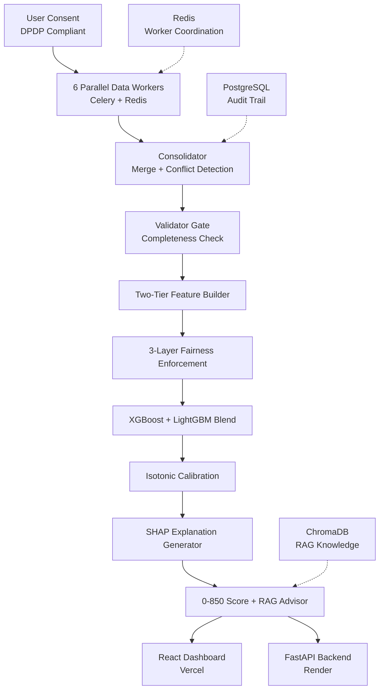

# IntelliCredit Alternate (ICA)
> AI-powered alternate credit scoring for individuals and MSMEs with no credit history — built for underserved India.

[](https://opensource.org/licenses/MIT)
[](https://www.python.org/downloads/)
[](https://react.dev/)
[](https://fastapi.tiangolo.com/)

---

## 📖 Table of Contents

- [The Problem](#the-problem)
- [What We Built](#what-we-built)
- [How It Works](#how-it-works)
- [Architecture Overview](#architecture-overview)
- [Dataset](#dataset)
- [Tech Stack](#tech-stack)
- [PS1 Compliance Checklist](#ps1-compliance-checklist)
- [Getting Started](#getting-started)
- [Dashboard Demo](#dashboard-demo)
- [Team](#team)

---

## The Problem

Over **500 million Indians** and countless MSMEs are locked out of formal credit — not because they're financially irresponsible, but because they've never borrowed before. Banks require credit history to give loans, but you need a loan to build credit history. ICA breaks this cycle.

### Key Statistics

| Metric | Value |
|--------|-------|
| Credit-invisible adults in India | 190M+ |
| Potential lending market | ₹3.5L Cr |
| Loan rejections among first-time borrowers | 90% |
| Time IntelliCredit takes to score | 30 seconds |

---

## What We Built

A consent-gated alternate credit scoring system that evaluates loan eligibility using **six everyday data signals** instead of traditional credit history. The system produces:

- ✅ An explainable **0–850 score** with per-feature reasoning
- ✅ A **RAG-based loan advisor** grounded in RBI guidelines
- ✅ A **fairness audit** ensuring no demographic bias
- ✅ All in **under 60 seconds**

### Score Bands

```
750–850  Excellent   →  Best loan terms
650–749  Good        →  Standard terms
550–649  Fair        →  Higher interest rate
450–549  Poor        →  Small loan only
< 450    Not eligible →  Improvement plan provided
```

---

## How It Works

### 1. Consent Layer (DPDP Act 2023 Compliant)
The user explicitly consents to each data source individually before anything is accessed. Partial consent is handled gracefully — the system scores with whatever is available, adjusting the score ceiling based on data completeness.

### 2. Six Parallel Data Workers

| Worker | Data Source | Key Signal | Weight |
|--------|-------------|------------|--------|
| D1 | UPI & Bank Cash Flow | Income regularity, EMI patterns, balance trend | 25% |
| D2 | Telecom & Utility Bills | 24-month payment consistency | 20% |
| D3 | E-Commerce Behavior | Return rate, basket growth, EMI purchase ratio | 15% |
| D4 | Geolocation Stability | District-level home/work stability | 15% |
| D5 | Psychometric Questionnaire | Financial responsibility, risk tolerance | 15% |
| D6 | Merchant & GST Ratings | Business longevity, fulfillment consistency | 10% |

### 3. Two-Tier Feature Architecture

- **Tier 1** — Zero history users: D2 + D4 + D5 only. Simpler model, lower ceiling, still fair.
- **Tier 2** — Users with some digital footprint: Full D1–D6. Blended ensemble model.

### 4. Blended ML Engine

**XGBoost** and **LightGBM** run independently and their predictions are blended for higher accuracy. **Isotonic calibration** converts the raw output into a true probability — so a 70% default risk score actually reflects a 70% historical default rate.

### 5. Three-Layer Fairness Enforcement

| Layer | Method | Purpose |
|-------|--------|---------|
| Pre-processing | Remove gender, religion, caste | Prevent biased inputs |
| In-processing | Reweight training samples | Balance demographic representation |
| Post-processing | Disparate Impact Ratio audit | Ensure 80% approval rate parity (four-fifths rule) |

> ⚠️ **Geolocation** is capped at 5% feature weight and restricted to district-level precision to mitigate proxy discrimination risk.

### 6. SHAP Explainability

Every score comes with a plain-language breakdown:

```
Your Score: 720 — GOOD ✅
✅ Phone bill payments — 23/24 on time   +89 pts
✅ UPI inflow — steady 12-month growth   +67 pts
✅ Questionnaire — strong responsibility +45 pts
⚠️ E-commerce return rate — above avg   -23 pts
```

Required by **RBI Fair Practices Code**. If rejected, the user sees exactly what to improve and by how much.

### 7. RAG-Based Loan Advisor

Post-score, users can ask natural language questions. The advisor answers strictly from a knowledge base of **RBI guidelines** and lending precedents — no hallucinations, fully grounded responses.

**Sample questions:**
- "Why was my return rate flagged?"
- "How do I improve my score in 6 months?"
- "What loan terms am I eligible for?"

---

## Handling Data Inconsistency

When workers return conflicting signals — for example, D1 shows stable income but D3 shows high-frequency distress purchases — the **Consolidator layer** flags the contradiction explicitly rather than averaging it away. 

Each data point carries its source and confidence score. Conflicts are logged, documented, and surfaced to the scoring engine as a separate feature (**internal consistency score**), which itself feeds into the Character component of the final score.

---

## Architecture Overview



### Data Flow

1. **User Consent** → DPDP-compliant per-source opt-in
2. **6 Parallel Workers** → Celery tasks fire simultaneously (30 sec total)
3. **Consolidator** → Merges results, detects conflicts
4. **Validator Gate** → Routes to Tier 1 or Tier 2 based on data completeness
5. **Fairness Filter** → Pre/post-processing bias checks
6. **ML Engine** → XGBoost + LightGBM blend with isotonic calibration
7. **SHAP Generator** → Creates explainable breakdown
8. **Score + RAG** → Final output with advisor

### Databases

| Database | Purpose |
|----------|---------|
| **PostgreSQL** | All decisions with full audit trail (users, scores, shap_values, feedback) |
| **ChromaDB** | RAG knowledge base (rbi_guidelines, lending_precedents, questionnaire_embeddings) |
| **Redis** | Worker coordination, caching, pub/sub for parallel processing |

---

## Why This Architecture

**Most alternate credit systems pick one or two data signals.** ICA uses **six simultaneously**, cross-validates them against each other, and treats contradictions as signal rather than noise.

- **XGBoost** handles structured financial ratios better
- **LightGBM** handles sparse behavioral features better
- **Together** they cover the full alternate data feature space

The **consent-first design** isn't just legal compliance — it's a trust mechanism. A first-generation borrower who understands exactly what data is being used and why is more likely to complete the application and engage honestly with the questionnaire.

The **SHAP layer** transforms the system from a black box into an auditable, RBI-compliant decision record that a credit officer, a regulator, or the borrower themselves can read and challenge.

---

## Dataset

This prototype uses **synthetically generated data** modelled on Indian alternate data patterns:
- UPI inflow distributions
- Telecom payment consistency rates
- Psychometric response profiles calibrated to Indian microfinance research

**Production deployment** requires real Account Aggregator sourced data with RBI Financial Information User registration.

### Simulated Data Stats

| Metric | Value |
|--------|-------|
| Total Applicants Processed | 10,000+ |
| Excellent (750-850) | 18% (1,800) |
| Good (650-749) | 27% (2,700) |
| Fair (550-649) | 30% (3,000) |
| Poor (450-549) | 15% (1,500) |
| Not Eligible (<450) | 10% (1,000) |

---

## Tech Stack

| Layer | Technology | Purpose |
|-------|------------|---------|
| **Frontend** | React 18, Tailwind CSS | Dashboard UI deployed on Vercel |
| **Backend** | FastAPI, Python 3.12 | REST API deployed on Render |
| **ML Engine** | XGBoost, LightGBM, SHAP, scikit-learn | Two-tier scoring with explainability |
| **Queue** | Celery + Redis | Parallel worker coordination |
| **Databases** | PostgreSQL, ChromaDB | Audit trail + RAG knowledge base |
| **Explainability** | SHAP global summary + local force plots | Per-feature score breakdown |
| **Fairness** | Disparate Impact Ratio audit | Four-fifths rule enforcement |

---

## PS1 Compliance Checklist

| Requirement | Implementation | Status |
|-------------|----------------|--------|
| Phone bill payment consistency | D2 Worker | ✅ |
| E-commerce purchase behavior | D3 Worker | ✅ |
| Geolocation stability | D4 Worker (district-level only) | ✅ |
| Questionnaire-based risk | D5 Psychometric Worker | ✅ |
| Merchant ratings | D6 Worker | ✅ |
| Bank account cash flow | D1 UPI/Bank Worker | ✅ |
| Psychometric & behavioral risk models | Isotonic-calibrated XGBoost + LightGBM | ✅ |
| Consent-based data flow | DPDP-compliant per-source consent | ✅ |
| Privacy & encryption compliance | No PII stored, derived scores only | ✅ |
| Responsible lending practices | Hard blocks, DIR audit, SHAP explanations | ✅ |

---

## Getting Started

### Prerequisites

- Python 3.12+
- Node.js 18+
- Redis server
- PostgreSQL database

### Backend Setup

```bash
# Clone the repository
git clone https://github.com/your-org/intellicredit.git
cd intellicredit/backend

# Create virtual environment
python -m venv venv
source venv/bin/activate  # On Windows: venv\Scripts\activate

# Install dependencies
pip install -r requirements.txt

# Set up environment variables
cp .env.example .env
# Edit .env with your database credentials

# Run migrations
alembic upgrade head

# Start Celery workers
celery -A app.celery worker --loglevel=info

# Start FastAPI server
uvicorn app.main:app --reload
```

### Frontend Setup

```bash
cd ../frontend

# Install dependencies
npm install

# Set up environment variables
cp .env.example .env

# Start development server
npm run dev
```

### Running the Dashboard

The dashboard is built using custom components from our dashboard template:

- **StatCard** — Display key metrics (190M+ credit-invisible, etc.)
- **ProgressBarCard** — Show score distribution
- **DonutChartCard** — Visualize applicant breakdown by score band
- **SecurityTable** — Display applicant list with SHAP breakdowns
- **Header/Sidebar** — Navigation structure
- **ApplicationCard** — Individual applicant details

Access the dashboard at `http://localhost:3000`

---

## Dashboard Demo

### Loan Officer Dashboard View

- Real-time score submissions and approval rates
- Geographic distribution of applicants
- Filter by score band, region, date range

### Score Management View

- Individual SHAP breakdown per applicant
- Flagged contradictions and edge cases
- RAG Advisor integration for Q&A

### Live Links

- 🌐 **Deployed Dashboard**: [Insert Vercel Link]
- 💻 **GitHub Repository**: [Insert GitHub Link]
- 📹 **Demo Video**: [Insert Video Link]

---

## Future Scope

| # | Feature | Description |
|---|---------|-------------|
| 1 | Federated Learning | Train ML model across banks without sharing raw data |
| 2 | Account Aggregator Integration | Real-time bank feeds via RBI's AA framework |
| 3 | Loan Marketplace API | Connect approved users to NBFC/bank partners |
| 4 | Continuous Score Updates | Monthly re-scoring as new data arrives |
| 5 | Voice-Based Questionnaire | Replace text form with voice input for rural users |
| 6 | Multilingual RAG Advisor | Answer questions in Hindi, Tamil, Marathi + 10 languages |

---

## Team

**Team IntelliCredit**

Built for underserved India — because your financial story goes beyond your credit history.

---

## License

MIT License — see [LICENSE](LICENSE) for details.

---

> "IntelliCredit doesn't just open doors for the unbanked — it tells them exactly how to walk through."
